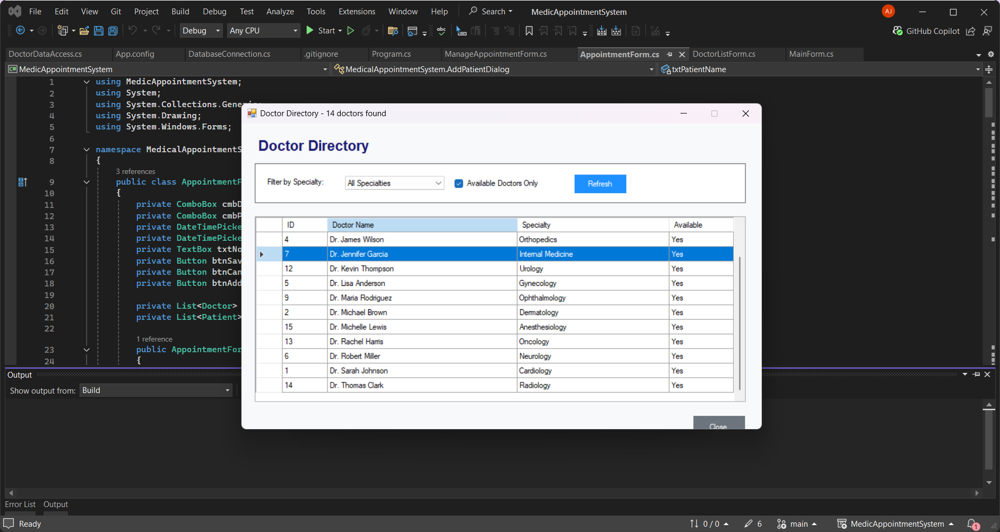
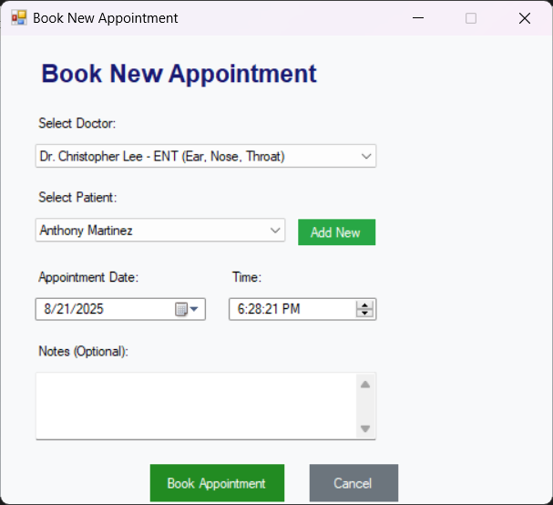
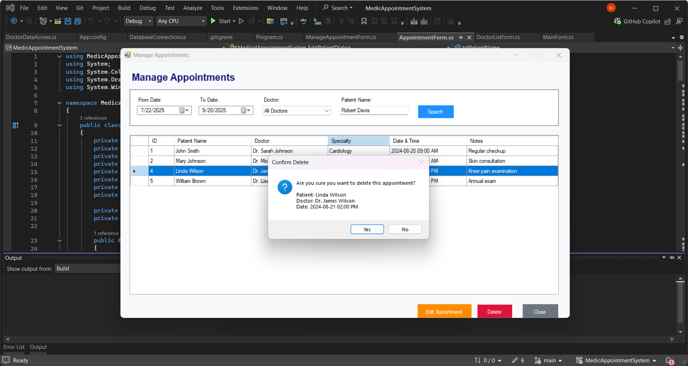

# 🩺 Medical Appointment Booking System (WinForms + SQL Server)

A Windows Forms application that allows **patients** to book, view, search/filter, modify, and delete medical appointments. Built with **C# (.NET Framework / WinForms)** and **ADO.NET** against **SQL Server**.

---


---

## 📋 Table of Contents

* [Features](#-features)
* [Architecture](#-architecture)
* [Screenshots](#-screenshots)
* [Database Setup](#-database-setup)
* [App Configuration](#-app-configuration)
* [Project Structure](#-project-structure)
* [Build & Run](#-build--run)
* [Validation & Error Handling](#-validation--error-handling)
* [Roadmap / Future Enhancements](#-roadmap--future-enhancements)
* [License](#-license)

---

## ✅ Features

* Book appointments with doctors
* View available doctors and specialties
* Search & filter appointments by date, doctor, or patient
* Update or reschedule appointments
* Delete bookings
* Uses **ADO.NET** with parameterized commands, **DataReaders**, **DataAdapters**, and **DataSets**
* Event-driven UI using Windows Forms controls

---

## 🧱 Architecture

**Windows Forms**:

* **MainForm** – Landing page with navigation
* **DoctorListForm** – Displays doctors in a `DataGridView`
* **AppointmentForm** – Create a new appointment
* **ManageAppointmentsForm** – View, update, or delete appointments

**Data Access Layer**:

* Uses **ADO.NET** for database operations
* Parameterized queries to prevent SQL injection
* Data bound to controls via `DataGridView`, `ComboBox`, etc.

---

## 🖼️ Screenshots

* ***Main Form**
  

* **Database Connection**
  

* **Doctor List**
  

* **Book Appointment**
  

* **Manage Appointments**
  

---

## 🗄️ Database Setup

Create a SQL Server database named **`MedicalDB`** and run the following script:

```sql
CREATE DATABASE MedicalDB;
GO

USE MedicalDB;
GO

CREATE TABLE Doctors (
    DoctorID INT IDENTITY(1,1) PRIMARY KEY,
    FullName VARCHAR(100) NOT NULL,
    Specialty VARCHAR(100) NOT NULL,
    Availability BIT NOT NULL DEFAULT 1
);

CREATE TABLE Patients (
    PatientID INT IDENTITY(1,1) PRIMARY KEY,
    FullName VARCHAR(100) NOT NULL,
    Email VARCHAR(255) NOT NULL
);

CREATE TABLE Appointments (
    AppointmentID INT IDENTITY(1,1) PRIMARY KEY,
    DoctorID INT NOT NULL FOREIGN KEY REFERENCES Doctors(DoctorID),
    PatientID INT NOT NULL FOREIGN KEY REFERENCES Patients(PatientID),
    AppointmentDate DATETIME NOT NULL,
    Notes VARCHAR(500) NULL
);
```

---

## ⚙️ App Configuration

Store your connection string in **`App.config`**:

```xml
<connectionStrings>
  <add name="MedicalDb"
       connectionString="Data Source=YOUR_SERVER_NAME;Initial Catalog=MedicalDB;Integrated Security=True"
       providerName="System.Data.SqlClient" />
</connectionStrings>
```

---

## 🗂️ Project Structure

```
MedicAppointmentBookingSystem/
├─ MedicAppointmentBookingSystem.sln
├─ App.config
├─ /Screenshots
├─ /Forms
│  ├─ AppointmentForm.cs
|  ├─ DataBaseConnection.cs
│  ├─ DoctorDataAccess.cs
│  ├─ DoctorListForm.cs
│  ├─ MainForm.cs
│  └─ ManageAppointmentsForm.cs

```

---

## ▶️ Build & Run

1. **Clone** the repository:

   ```bash
   git clone https://github.com/EbenzerBaafi/MedicalAppointmentBookingSystem.git
   cd MedicalAppointmentBookingSystem
   ```
2. Create the database using the script above.
3. Update the connection string in `App.config`.
4. Open the solution in **Visual Studio**.
5. Build and run the app (F5).

---

## 🛡️ Validation & Error Handling

* Validates user input (dates, availability, etc.)
* Uses **try-catch** blocks for database operations
* Displays user-friendly error messages via `MessageBox.Show`
* Ensures database connections are properly closed

---

## 🗺️ Roadmap / Future Enhancements

* Doctor-specific time slots
* Patient authentication
* Email appointment reminders
* Export appointments to CSV or PDF

---

## 📄 License

This project is licensed under the **MIT License**. See `LICENSE` for details.
